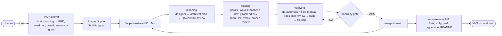

# AI Product Team for Claude Code

A repository template that turns Claude Code into a product team — **Team Lead, Architect, Designer, Backend and Frontend developers, Manual QA, QA Automation and Security** — that takes a product from a one-line idea to a tested MVP with minimal human involvement.

It is glue, not a new framework: it reuses [superpowers](https://github.com/obra/superpowers) as the engineering engine (plan → TDD implementation → independent review), native Claude Code subagents, hooks and `/goal`, and your daily tools — playwright-cli, Supabase, Strix, ui-ux-pro-max, context7, claude-mem and OmniRoute. What it adds: roles with file ownership, a milestone pipeline with deterministic gates, a file-based board, independent evaluators with scorecards, and an autopilot.



## Quick start

```bash
# 1. Use this template (GitHub "Use this template") or install into a project
python3 team/bin/install.py ~/code/my-product --new        # or: … ~/code/existing-repo
cd ~/code/my-product

# 2. Install plugins and CLIs, verify
bash team/bin/setup.sh            # --with-strix --with-claude-mem for the optional tools
bash team/bin/doctor.sh

# 3. Kickoff with the human (the only interactive phase)
claude
> /mvp-kickoff A marketplace where local bakers take pre-orders

# 4. Go autonomous
> /mvp-autopilot                  # prints how to start; then paste the /goal line it gives you
# or headless:  bash team/bin/autopilot.sh --mode auto
```

Step by step instead of autopilot: `/mvp-milestone M0`, `/mvp-milestone M1`, …, `/mvp-release`. Progress any time: `/mvp-status`.

**Free / local models:** run the whole team on a local model (Ollama) plus optional free API tiers — no Claude subscription: [team/LOCAL-FREE.md](team/LOCAL-FREE.md).

**Cloud sessions** (claude.ai/code, mobile, `claude --cloud`): the team runs there too — with the laptop closed. One-time environment setup (setup script for plugins, network allowlist, env vars) is in [team/CLOUD.md](team/CLOUD.md).

## The team

| Role | Agent | Model | Key tools |
|---|---|---|---|
| Team Lead | main session / `claude --agent team-lead` | opus | `/mvp-*` skills, superpowers (brainstorming, code-review), `board.py wave`, board.py |
| Architect | `architect` | opus | superpowers:writing-plans, context7, ADRs, Supabase schema design |
| Designer | `designer` | sonnet | ui-ux-pro-max, frontend-design, playwright-cli screenshots |
| Backend | `backend-dev` | sonnet | superpowers TDD, Supabase local + MCP, context7, supabase skills |
| Frontend | `frontend-dev` | sonnet | superpowers TDD, frontend-design, typescript-lsp, playwright-cli |
| Manual QA | `qa-manual` | sonnet | playwright-cli, exploratory charters, scorecard |
| QA Automation | `qa-automation` | sonnet | Vitest, Playwright Test Agents (planner/generator/healer), axe |
| Security | `security-auditor` | sonnet | Strix, security-guidance, RLS/secret/dependency checks |

Details, alternatives and add-ons per role: [team/ROLES.md](team/ROLES.md).

## Commands

| Command | Who | What |
|---|---|---|
| `/mvp-kickoff <idea>` | human + lead | spec → PRD → roadmap → board → autonomy grant |
| `/mvp-milestone <M>` | lead | one milestone end to end (resumable) |
| `/mvp-release` | lead | release hardening and handover |
| `/mvp-autopilot` | human starts | autonomous run via built-in `/goal` |
| `/mvp-status` | anyone | where we are, what's next |
| `python3 team/bin/board.py …` | everyone | the board: `status`, `list`, `new`, `move`, `check`, `gate`, `next-step`, `scaffold` |
| `bash team/bin/quality-gate.sh fast\|full` | everyone, CI | lint, types, unit / + integration, build, e2e |
| `bash team/bin/app.sh start\|stop\|status\|url\|logs` | QA, designer, security | the one way to run the app |

## Guarantees (mechanical, not prompt-based)

| Mechanism | Enforces |
|---|---|
| `board.py gate` | a milestone is done only with all items closed, AC checked with evidence, no critical/high bugs, PASS verdicts from tests, QA, design review (UI) and security (release), and a green full quality gate |
| `role-guard` hook | each role writes only its own files; the board changes only via board.py |
| `guard-bash` hook | no push/deploy/publish, no cloud Supabase, no `curl \| sh`, `sudo`, destructive `rm`; Strix only against localhost; subagents can't touch hooks/settings |
| `dev-gate` hook | developers can't hand in work while lint/types/unit tests are red |
| `SessionStart` hook | every session starts with board state and recent commits |
| `AUTONOMY.md` | written boundary of what the team may decide alone; everything else escalates as `needs_human` |

## Human touchpoints
1. Kickoff: answer the brainstorming questions, approve the PRD/roadmap and the autonomy grant.
2. Items flagged `needs_human` (`/mvp-status` lists them).
3. Handover: push, deploy, production Supabase, secrets — the team never does these.

## Cost and expectations
Multi-agent runs are token-heavy: Anthropic reports ~15× chat tokens for multi-agent systems, and $125–200 / 4–6 hours for a full-stack app built by a planner-generator-evaluator harness. This template keeps it lean: **one review per milestone** (not per task), workers skip re-loading CLAUDE.md (`omitClaudeMd`; hooks still enforce the rules), per-role best practices load **on demand** from `team/practices/`, opus only for planning + final review, and roles delegate wide reads to `Explore`. Further levers (fewer milestones, optional evaluators off) — see [team/OPERATIONS.md](team/OPERATIONS.md). Run a pilot on a small idea first.

## Repository map
```
CLAUDE.md                 project notes + @team/CONSTITUTION.md
.claude/agents/           8 roles (+ Playwright test agents added in M0)
.claude/skills/           mvp-kickoff, mvp-milestone, mvp-release, mvp-autopilot, mvp-status + role methods
.claude/hooks/            guard-bash, role-guard, dev-gate, session-start
.claude/settings.json     permissions, hooks, plugins, MCP
.mcp.json                 supabase-local (http://127.0.0.1:54321/mcp)
team/CONSTITUTION.md      rules every role follows
team/practices/           per-role best practices (what/how/where), read on demand
team/bin/                 board.py, quality-gate.sh, app.sh, autopilot.sh, setup.sh, doctor.sh, install.py, llm-check.sh
team/templates/           PRD, roadmap, autonomy, ADR, reports with verdicts, specs
team/ownership.json       who may write where
docs/                     the product's system of record (filled by the team)
```

Further reading: [team/SETUP.md](team/SETUP.md) · [team/LOCAL-FREE.md](team/LOCAL-FREE.md) · [team/CLOUD.md](team/CLOUD.md) · [team/OPERATIONS.md](team/OPERATIONS.md) · [team/ROLES.md](team/ROLES.md) · [team/RATIONALE.md](team/RATIONALE.md)
